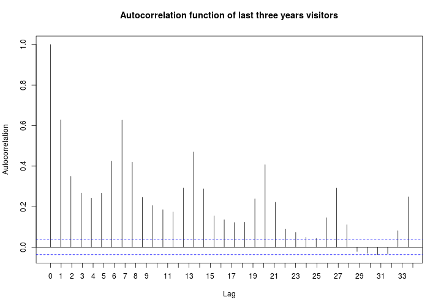
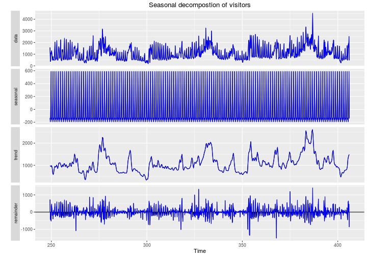
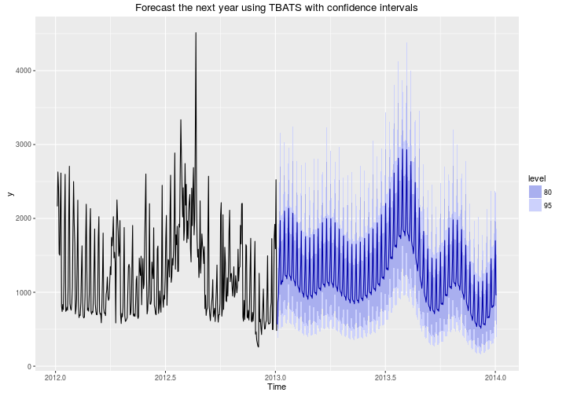

## Outline


```
## Error in as.Date.numeric(new_date): 'origin' must be supplied
```
 * The problem
 
 * Is it a forecast problem?
 
 * Weakly seasonality
 
 * Multiseasonal time series
 
 * Machine learning approach


---

## The problem

### Forecasting the number of visitors to Nettebad Osnabrück. Using
* Visitors to the pool from 2005-03-20
* Some variables about the pool such as events, classes, availability of certain facilities etc.
* Weather data

https://inclass.kaggle.com/c/swimming-pool-visitor-forecasting


---
<!-- Timo, Thomas,  -->


## Is it a forecast problem?
* It seems so, but looking at the lag plots ...


---

## Is it a forecast problem?
* It seems so, but looking at the lag plots ...


---

## Is it a forecast problem?
* It seems so, but looking at the lag plots ...


---
## Is it a forecast problem?
* It seems so, but looking at the lag plots ...


---

## Is it a forecast problem
* And the autocorrelation plot



---
## Weekly seasonality
- Autocorrelation plot suggested weekly seasonality in the data 
- The missing days is imputed and the time series is decomposed


---

## Accuracy of the seasonality

```
## Error in data.frame(weekday = we, Total.Visitors = visitors, Seasonality.Removed = rem): arguments imply differing number of rows: 2820, 2837
```

```
## Error in melt(d, id.vars = "weekday"): object 'd' not found
```

```
## Error in ggplot(data, aesthetics, environment = env): object 'melted' not found
```

---

## Forecasting via decomposition


---


## Last three years


---

## Last three years


- One could remove seasonality and do the prediction on the remainder, then add seasonality

- The best RMSE I could get with this approach was 330.15

---
## Multiseasonality approach
* As there are two kinds of sesonality, one can use multiseasonal time series and TBATS


---
## Forecast by TBATS
* Reached RMSE of 376


---

## Machine learning approach

- School and bank holidays
- Weekday and month name to  consider seasonality
- Weather data (temprature, wind, preception,...)
- New features
    * Monthly average temprature
    * Warmer than monthly average
    * Warmer than the previous day
    * Heat index
- Adjust prices by consumer price index (CPI)

---

## Machine learning approach

- Train a random forest to get feature importance
- Use the most important feature (99% cumulative importance)
- Use gradient boosting (XGboost) for the final prediction
- Adjust christmas and new years manually to the previous year value

* The final rmse is 247.33 (269.89 without manuall adjusment)

---

## Machine learning approach


---

## Machine learning approach


---


## Thank you for your patience

---

## With confidence interval

---
